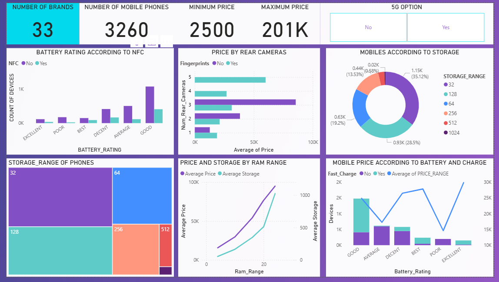

# Smartphone Analytics – Power BI Dashboard

## Project Overview
This project provides an analytical overview of the smartphone market using interactive Power BI dashboards. The analysis explores pricing, storage, battery performance, camera specifications, and advanced features such as NFC, fast charging, and 5G support. The goal is to identify trends in smartphone specifications and pricing, helping consumers and businesses make informed decisions.

## Objectives
- Analyze smartphone pricing and specifications across multiple brands.  
- Study the relationship between price and features like battery rating, RAM, storage, and camera count.  
- Understand the distribution of devices based on storage and RAM ranges.  
- Explore how modern features such as NFC, fingerprints, fast charging, and 5G affect price and adoption.  

## Data Preparation
**Data Source:** Smartphones dataset (CSV file)  

**Cleaning & Transformation:**  
- Removed duplicates and standardized categories.  
- Converted price and storage ranges into numerical formats.  
- Created calculated measures in DAX for metrics like average price by RAM, average storage, and price by rear cameras.  

## Key Features & Insights

### KPIs
- Number of brands  
- Total phones analyzed  
- Minimum & maximum price  
- Devices supporting 5G, NFC, fast charging, and fingerprint unlock  

### Visualizations
- **Battery Rating vs NFC:** Device performance categorized by rating  
- **Price by Rear Cameras:** Price comparison by number of cameras & fingerprint support  
- **Storage Distribution:** Donut chart showing device share across storage ranges (32GB to 1TB)  
- **Storage Treemap:** Breakdown of devices by storage levels  
- **Price & Storage by RAM Range:** Relationship between RAM and both price & storage capacity  
- **Battery & Charging Impact on Price:** How fast charging and battery rating influence device pricing  

## Tools & Technologies
- **Power BI Desktop** – Dashboard design and development  
- **Power Query** – Data cleaning and ETL processes  
- **DAX** – Custom measures for price, storage, and KPI calculations  

## Deliverables
- Interactive Power BI dashboard (.pbix)  
- Smartphone insights summary dashboard with filters and slicers  

## Dashboard Preview

